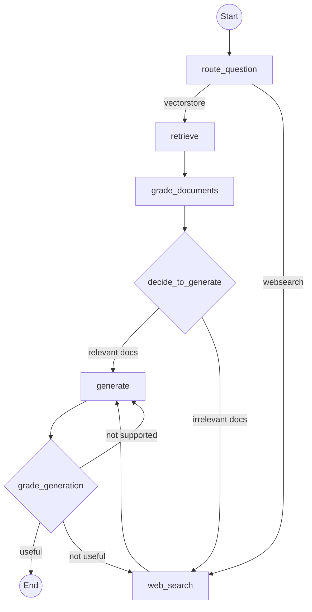

# 🧠 Agentic RAG with LangGraph, Groq & ChromaDB

[](https://www.python.org/downloads/)
[](https://langchain-ai.github.io/langgraph/)
[](https://github.com/langchain-ai/langchain)
[](https://groq.com/)
[](https://www.trychroma.com/)
[](https://opensource.org/licenses/MIT)

An advanced, self-correcting **Agentic Retrieval-Augmented Generation (RAG)** pipeline powered by **LangGraph**, **Groq LLMs**, **HuggingFace Embeddings**, and **ChromaDB**. 

Unlike static RAG systems that blindly generate answers from retrieved documents, this project implements an **intelligent state machine** that evaluates document relevance, checks for hallucinations, assesses question answering quality, and dynamically falls back to web search when local context is insufficient.

---

## 🌟 Why Agentic RAG?

Standard RAG architectures suffer from three critical failure modes:
1. **Irrelevant Retrieval:** Retrieving poor or out-of-domain chunks leads to inaccurate answers.
2. **Hallucinations:** Generative models may fabricate facts not grounded in retrieved documents.
3. **Static Knowledge Bounds:** When local vector stores lack the answer, traditional RAG fails silently.

**Agentic RAG** solves these challenges by turning the retrieval pipeline into a cyclical decision-making graph:
* 🧭 **Semantic Question Router:** Directs queries to either local vector storage or live web search based on domain relevance.
* 📋 **Document Grader:** Filters out irrelevant chunks before passing them to the LLM.
* 🌐 **Dynamic Web Search Fallback:** Automatically supplements missing knowledge using **Tavily Search** if local documents are deemed insufficient.
* 🛡️ **Hallucination & Utility Guardrails:** Evaluates generated responses for factual grounding and answer relevance, triggering automated retries or fallback search if needed.

---

## 🏗️ Architecture & Graph Workflow

The application workflow is orchestrated as a state graph using `LangGraph`:



### Flow Breakdown
1. **`route_question`**: Uses a structured LLM router (`RouteQuery`) to inspect the user's intent. If the query concerns supported domains (e.g., LangChain, LangGraph), it routes to `retrieve`; otherwise, it routes directly to `web_search`.
2. **`retrieve`**: Queries the local persistent **ChromaDB** vector store using **HuggingFace** embeddings (`BAAI/bge-small-en-v1.5`).
3. **`grade_documents`**: A binary evaluator inspects each retrieved document. Relevant chunks are kept; if any chunk is irrelevant, a flag triggers supplemental `web_search`.
4. **`web_search`**: Powered by **Tavily API**, fetching top web results and appending them as structured context.
5. **`generate`**: Synthesizes a concise, grounded response from the curated document context using Groq (`openai/gpt-oss-120b`).
6. **`grade_generation`**:
   * **Hallucination Check**: Ensures every claim in the response is supported by the context. If unsupported, it retries `generate`.
   * **Answer Quality Check**: Ensures the response addresses the user's question. If not useful, it falls back to `web_search`.

---

## 🔑 Environment Requirements (`.env`)

Create a `.env` file in the root directory of the project. The application requires API keys for LLM inference (Groq) and web search fallback (Tavily).

### `.env.example`

```ini
# =====================================================================
# GROQ API CONFIGURATION (Required)
# =====================================================================
# Used for structured routing, document grading, hallucination checks,
# and answer generation.
# Get your API key at: https://console.groq.com/keys
GROQ_API_KEY="gsk_your_groq_api_key_here"

# =====================================================================
# TAVILY API CONFIGURATION (Required)
# =====================================================================
# Used for live web search fallback when vectorstore retrieval fails.
# Get your API key at: https://tavily.com/
TAVILY_API_KEY="tvly-your_tavily_api_key_here"

# =====================================================================
# HUGGINGFACE CONFIGURATION (Optional)
# =====================================================================
# BAAI/bge-small-en-v1.5 embeddings run locally by default via
# sentence-transformers. Set this token only if accessing gated models
# or to increase rate limits.
# HF_TOKEN="hf_your_huggingface_token_here"
```

### Summary of Environment Variables

| Variable | Required | Default | Description |
| :--- | :---: | :---: | :--- |
| `GROQ_API_KEY` | **Yes** | *None* | Authenticates requests to Groq Cloud for fast inference using `openai/gpt-oss-120b`. |
| `TAVILY_API_KEY` | **Yes** | *None* | Authenticates requests to Tavily AI for search result aggregation. |
| `HF_TOKEN` | *No* | *None* | Optional token for HuggingFace Hub model access. |

---

## 🛠️ Tech Stack & Dependencies

* **Graph & Orchestration**: [LangGraph](https://langchain-ai.github.io/langgraph/) & [LangChain Core](https://python.langchain.com/)
* **LLM Inference**: [Groq Cloud](https://groq.com/) (`langchain-groq`) using `openai/gpt-oss-120b`
* **Embeddings**: [HuggingFace Embeddings](https://huggingface.co/) (`BAAI/bge-small-en-v1.5`) via `sentence-transformers`
* **Vector Store**: [ChromaDB](https://www.trychroma.com/) (`langchain-chroma`) with local disk persistence
* **Web Search**: [Tavily Search API](https://tavily.com/) (`langchain-tavily`)
* **Package Management**: [uv](https://github.com/astral-sh/uv) (Python 3.12+)

---

## 🚀 Installation & Setup

### 1. Clone the Repository
```bash
git clone https://github.com/your-username/agentic-rag.git
cd agentic-rag
```

### 2. Install Dependencies
This project uses modern Python packaging configured via `pyproject.toml`. We recommend using [uv](https://github.com/astral-sh/uv) or standard `pip` in a virtual environment:

```bash
# Using uv (Recommended)
uv sync

# OR using Python venv & pip
python -m venv .venv
source .venv/bin/activate  # On Linux/macOS
# .\.venv\Scripts\activate # On Windows
pip install -e .
```

### 3. Configure API Keys
Copy the example configuration and add your actual API keys:

```bash
cp .env.example .env
# Edit .env with your favorite editor (vim, nano, VS Code)
```

---

## 📖 Usage Guide

### Step 1: Ingest Knowledge Base
Before querying the vector store, load web documentation and build the local ChromaDB database:

```bash
python ingestion.py
```

*This script fetches target URLs (e.g., LangChain and LangGraph official documentation), splits them into overlapping 1000-character chunks using `RecursiveCharacterTextSplitter`, generates embeddings, and persists them into `./chroma_db`.*

### Step 2: Run the Agentic RAG Pipeline
Execute a query against the compiled LangGraph workflow:

```bash
python main.py
```

You will see console log traces showing the exact decision path the agent takes:
```text
---ROUTE QUESTION---
---ROUTE QUESTION TO RAG---
--- RETRIEVE ---
--- CHECK DOCUMENT RELEVANCE ---
--- GRADE: RELEVANT ---
--- ASSESS GRADED DOCUMENTS ---
--- DECISION: GENERATE ---
--- GENERATE ---
---CHECK HALLUCINATIONS---
---DECISION: GENERATION IS GROUNDED IN DOCUMENTS---
---GRADE GENERATION vs QUESTION---
---DECISION: GENERATION ADDRESSES QUESTION---
```

### Step 3: Inspect Vector Chunks (Utility)
To audit the stored ChromaDB contents, inspect embeddings, and review chunk metadata:

```bash
python chunks_view.py
```

### Step 4: Test Search Tooling (Utility)
To verify your Tavily search integration independently:

```bash
python test.py
```

---

## 📂 Project Structure

```text
agentic-rag/
├── graph/                         # LangGraph state machine definition
│   ├── chains/                    # Specialized LLM grading & routing chains
│   │   ├── answer_grader.py       # Validates if generation answers the prompt
│   │   ├── generation.py          # RAG response generation prompt & chain
│   │   ├── hallucination_grader.py# Checks grounding against retrieved docs
│   │   ├── retrieval_grader.py    # Binary relevance grader for docs
│   │   └── router.py              # Routes query to vectorstore or websearch
│   ├── nodes/                     # LangGraph workflow nodes
│   │   ├── generate.py            # Node for answer synthesis
│   │   ├── grade_documents.py     # Node for filtering relevant docs
│   │   ├── retrieve.py            # Node for ChromaDB similarity search
│   │   └── web_search.py          # Node for Tavily web search fallback
│   ├── consts.py                  # Graph node constants
│   ├── graph_builder.py           # StateGraph assembly & compilation
│   └── state.py                   # TypedDict state definition (GraphState)
├── chroma_db/                     # Persistent local vector database
├── ingestion.py                   # Web loading, chunking, and ChromaDB indexing
├── main.py                        # Application entry point
├── chunks_view.py                 # Utility to inspect Chroma index chunks
├── test.py                        # Utility to test Tavily search tool
├── pyproject.toml                 # Project metadata and dependencies
└── README.md                      # Project documentation
```

---

## 🧪 Testing & Validation

The project uses `pytest` for unit and integration testing. Run tests across the codebase:

```bash
pytest
```

---

## 🤝 Contributing

Contributions, issues, and feature requests are welcome!
1. Fork the Project
2. Create your Feature Branch (`git checkout -b feature/AmazingFeature`)
3. Commit your Changes (`git commit -m 'Add some AmazingFeature'`)
4. Push to the Branch (`git push origin feature/AmazingFeature`)
5. Open a Pull Request

---

## 📜 License

Distributed under the MIT License. See `LICENSE` for more information.
